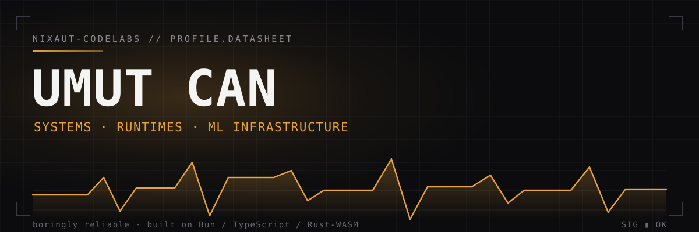
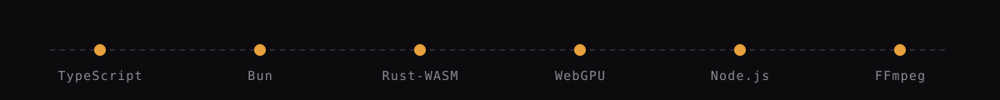
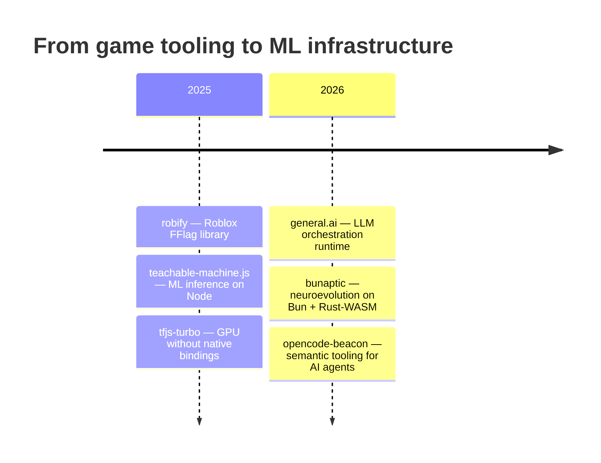

<picture>
  <source media="(prefers-color-scheme: dark)" srcset="hero.svg">
  
</picture>

# Umut Can — nixaut-codelabs

I build the layer between machine-learning models and hardware they never talk to directly: GPU bridges with no native bindings, neuroevolution engines on flat typed arrays and Rust-WASM kernels, semantic search over codebases, orchestration runtimes for LLM agents.

The common thread: **make the slow thing fast and the fragile thing crash-safe — then prove it with tests, not adjectives.**

`7 public repos · 5 packages on npm · MIT / Apache-2.0 · Bun + TypeScript strict`

<picture>
  <source media="(prefers-color-scheme: dark)" srcset="terminal.svg">
  
</picture>

## Shipped

| Project | What it does | npm |
|---|---|---|
| [**teachable-machine.js**](https://github.com/nixaut-codelabs/teachable-machine.js) | Teachable Machine inference on Node.js — batched, RAM-first with disk fallback, image + video through one API | `2.0.2` · ~95 dl/mo |
| [**tfjs-turbo**](https://github.com/nixaut-codelabs/tfjs-turbo) | TensorFlow.js on Node & Bun via WebGPU / WebGL / WASM — the native-free alternative to tfjs-node, with crash-safe checkpoint & resume | `2.0.0` · ~43 dl/mo |
| [**general.ai**](https://github.com/nixaut-codelabs/general.ai) | OpenAI-compatible orchestration runtime — tools, subagents, retries, provider key rotation, context management | `1.0.0` · ~22 dl/mo |
| [**bunaptic**](https://github.com/nixaut-codelabs/bunaptic) | Bun-first neural network & neuroevolution engine — typed arrays, Workers, Rust-WASM kernels, Node fallback | `0.1.0-alpha.1` · ~19 dl/mo |
| [**opencode-beacon**](https://github.com/nixaut-codelabs/opencode-beacon) | Semantic code search plugin for OpenCode — hybrid vector + BM25 search, dependency graph, change-impact analysis | `1.3.3` |

<picture>
  <source media="(prefers-color-scheme: dark)" srcset="stack-rail.svg">
  
</picture>

## Case notes

**tfjs-turbo — GPU without the native-binding tax.**
`tfjs-node` ships a compiled `.node` binding that breaks across OS and Node ABI combos, and its CUDA path is Linux-only. tfjs-turbo runs TensorFlow.js inside headless Chrome and bridges training back to Node/Bun over a control channel — WebGPU first, WebGL/WASM as automatic fallback. Training survives process crashes via IndexedDB-backed checkpoint & resume, and the examples double as the CI suite.

```javascript
import { TensorFlow } from 'tfjs-turbo';

const tf = new TensorFlow({ backend: 'wasm' });
await tf.ready();

const result = await tf.train({
    layers: [
        { type: 'dense', units: 64, activation: 'relu', inputShape: [10] },
        { type: 'dense', units: 1, activation: 'sigmoid' }
    ],
    compile: { optimizer: 'adam', loss: 'binaryCrossentropy' },
});
```

**bunaptic — neuroevolution rebuilt for modern runtimes.**
Neataptic proved flexible JS neural-network APIs are worth having; its runtime predates typed arrays, worker threads and WASM. Bunaptic keeps the API spirit and rebuilds the engine: flat `Float64Array` genomes, population evaluation across Workers, Rust-WASM kernels for dot-product-heavy paths, dense feed-forward fast paths. The README states the alpha limits on purpose — recurrent `adam`/`rmsprop` still run the TypeScript BPTT path.

<details>
<summary><b>How bunaptic benchmarks are timed</b> — the harness, not vibes</summary>

<br/>

`bench/harness.ts` measures every kernel the same way:

| Stage | What happens |
|---|---|
| warmup | `2` runs discarded (JIT + WASM compile excluded) |
| repeats | `7` timed runs, checksum-verified so dead-code elimination can't cheat |
| reported | **median** and **p95** of the sorted samples |

Profiles via `BENCH_PROFILE`: `ci` (warmup 1 · repeats 3 · 0.25× scale), `quick` (1 · 5 · 0.5×), `large` (2 · ≥10 · 2×), default `standard`.

</details>

**general.ai — orchestration as a protocol, not a wrapper.**
Raw SDK calls make agent behavior drift. general.ai adds a protocol layer on top of any OpenAI-compatible endpoint: tool and subagent definitions, retries, provider key rotation, request queueing, context compression and structured checkpoints — plus a `native` mode for when you want exact SDK semantics and nothing else.

**teachable-machine.js — inference that respects your RAM.**
Batched classification with a RAM-first pipeline, automatic disk fallback under memory pressure, and strict cleanup guarantees so long-running services don't leak. Video inputs are frame-sampled through FFmpeg; images and videos share one ergonomic API accepting URLs, paths, buffers and data URIs.

**opencode-beacon — search code by meaning.**
Embeddings alone miss exact identifiers; keywords alone miss intent. Beacon fuses vector + BM25 + identifier boosting into hybrid recall, then builds on it: dependency graphs, change-impact analysis ("what breaks if I touch this file?"), temporal search across git history and semantic diffs. Fifteen tools exposed to the agent.

## Trajectory



## Traction

Measured, not vibes. A monthly snapshot is appended automatically (`scripts/npm-metrics.sh` on a systemd timer) to [`metrics/npm-downloads.md`](metrics/npm-downloads.md).

Baseline **2026-10-04**: `230` downloads/month across the five packages · `8` stars total. Small numbers, published on purpose — the trend line is the point.

## How I work

- **Bun-first.** TypeScript strict, tests colocated with source, `bun test` as the merge gate.
- **Tests are the spec.** Crash-resume, backend fallback and folding correctness are proven by suites, never claimed in prose.
- **Root cause over symptom.** A fixed bug ships together with the test that would have caught it.
- **Honest status labels.** Alpha means alpha; download counts get published as-is, drift and all.

## Contact

- Email — codelabsnixaut@gmail.com
- GitHub — [@nixaut-codelabs](https://github.com/nixaut-codelabs)

<sub>npm versions and last-month download counts checked 2026-10-04. They will drift; publishing them anyway is the point.</sub>
